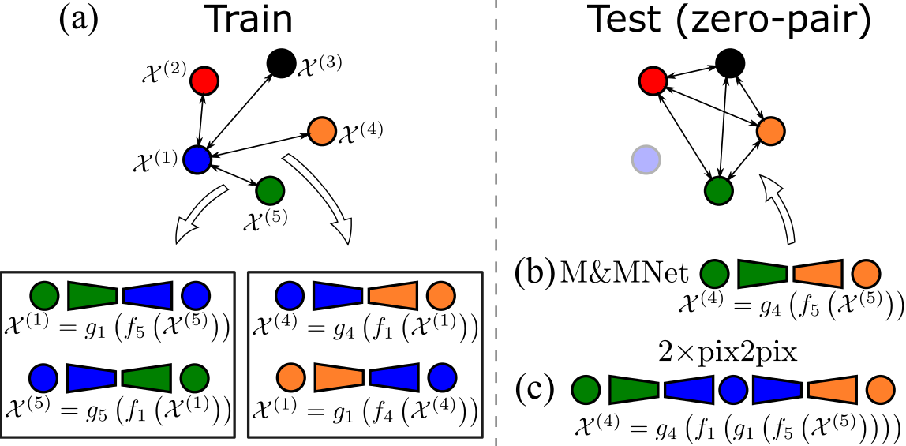
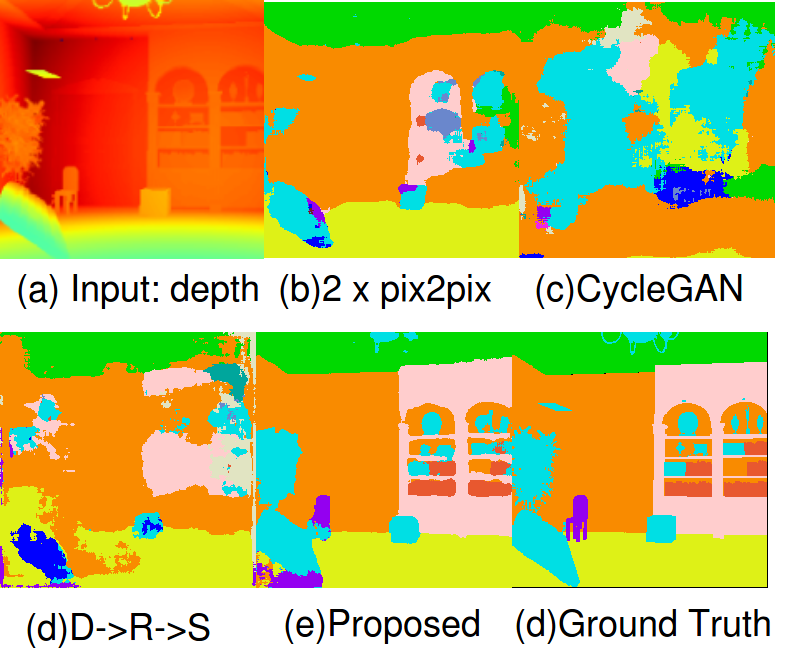

# Mix-and-match-networks
### [[paper]](https://arxiv.org/pdf/1804.02199.pdf)

[Mix and match networks: encoder-decoder alignment for zero-pair image translation](https://github.com/yaxingwang/Mix-and-match-networks)  
[Yaxing Wang](https://yaxingwang.github.io/),  [Joost van de Weijer](http://www.cvc.uab.es/LAMP/joost/), [Luis Herranz](http://www.lherranz.org/)  
 IEEE Conference on Computer Vision and Pattern Recognition ([CVPR](http://cvpr2018.thecvf.com/)), 2018

# Introduction 
This project is to do Mix-and-match-networks(M&Mnet) on color and RGBD datasets. We give two folders([color](https://github.com/yaxingwang/Mix-and-match-networks/tree/master/color/) and [RGBD](https://github.com/yaxingwang/Mix-and-match-networks/tree/master/RGBD/ )) where we share corresponding codes and detail information to train our M&Mnet. 

# Dataset 
- Color: the visualization   
<br>
<p align="center"></p>

- RGBD: the visualization   
<br>
<p align="center"></p>

If this work or color dataset are useful for your research, please cite  papers:
```
@article{wang2018mix,
  title={Mix and match networks: encoder-decoder alignment for zero-pair image translation},
    author={Wang, Yaxing and van de Weijer, Joost and Herranz, Luis},
      journal={arXiv preprint arXiv:1804.02199},
        year={2018}
        }
 @article{yu2018weakly,
   title={Weakly Supervised Domain-Specific Color Naming Based on Attention},
     author={Yu, Lu and Cheng, Yongmei and van de Weijer, Joost},
       journal={arXiv preprint arXiv:1805.04385},
         year={2018}
         }

```
# Contact
If you run into any problems with this code, please submit a bug report on the Github site of the project. For another inquries pleace contact with me: yaxing@cvc.uab.es


