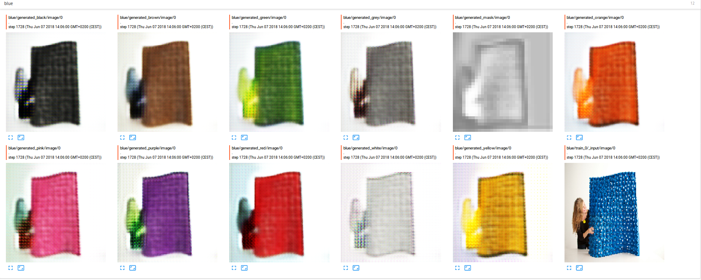

# Object recoloring

This project is to do many-to-many mapping on color dataset.

<p align="center"></p>

# Overview 
- [Dependences](#dependences)
- [Installation](#installtion)
- [Instructions](#instructions)
- [Citation](#citation)
- [Contact](#contact)
# Dependences 
- Python2.7, NumPy, SciPy, NVIDIA GPU
- **Tensorflow:** the version should be more 1.0(https://www.tensorflow.org/) and [TensorBoard](https://www.tensorflow.org/programmers_guide/summaries_and_tensorboard)
- **Dataset:** Domain-specific color name datase(https://drive.google.com/file/d/1xUU8B8vC3rxsA8eAOlyEs3ZyB5fgC0il/view) which is collected by [Luyu](https://yulu0724.github.io/) and compressed into tfrecords.  

# Installation 
- Install tensorflow and tensorBoard
- Opencv 
# Instructions
- Cloning the repository
```bash
$ git clone  https://github.com/yaxingwang/Mix-and-match-networks.git
$ cd Mix-and-match-networks/color/
```
- Downloading the dataset
```bash
$ mkdir dataset 
```
Unzipping the downloaded color data and moving contained two folders(`train` and `test`) into `dataset`

- Training 
```bash
$ python train.py 
```
During train, the loss and generated images can be monitored by tensorboard as:
```bash
$ cd checkpoints/20180607-1244 
$ tensorboard --logdir=./ 
```

Note that `20180607-1244` is automatically generated whenever you run script
<p align="center"></p>

- Testing 

The pretrained model is provided [here](https://drive.google.com/drive/folders/1Ny9g4_3IPxHXQirjPrhLFAZTlCEgMSIH). If you have trained model, just put it as following:
```bash
$ python test.py --test_file chedkpoints/20171109-1200/model.ckpt-7703 
```
# Citation

If this work is useful for your research and you use the color dataset, please cite  papers:
```
@article{wang2018mix,
  title={Mix and match networks: encoder-decoder alignment for zero-pair image translation},
    author={Wang, Yaxing and van de Weijer, Joost and Herranz, Luis},
      journal={arXiv preprint arXiv:1804.02199},
        year={2018}
        }
 yulu???

```


# Contact

If you run into any problems with this code, please submit a bug report on the Github site of the project. For another inquries pleace contact with me: yaxing@cvc.uab.es
