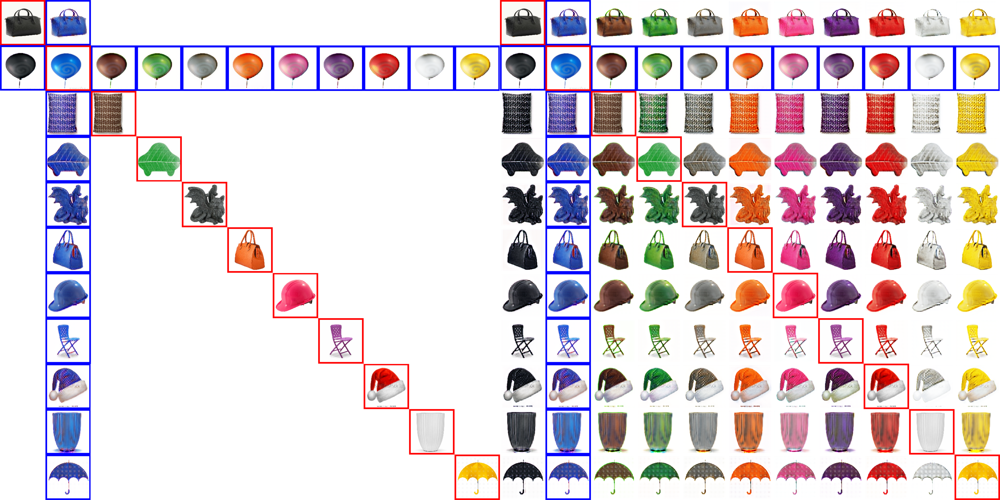

# Object recoloring

This project is to do many-to-many mapping on color dataset.

<p align="center"></p>

# Overview 
- [Dependences](#dependences)
- [Installation](#installtion)
- [Instructions](#instructions)
- [Results](#results)
- [References](#references)
- [Contact](#contact)
# Dependences 
- Python2.7, NumPy, SciPy, NVIDIA GPU
- **Tensorflow:** the version should be more 1.0(https://www.tensorflow.org/) and [TensorBoard](https://www.tensorflow.org/programmers_guide/summaries_and_tensorboard)
- **Dataset:** Domain-specific color name datase(https://drive.google.com/file/d/1xUU8B8vC3rxsA8eAOlyEs3ZyB5fgC0il/view) which is collected by [Luyu](https://yulu0724.github.io/) and compressed into tfrecords.  

# Installation 
- Install tensorflow and tensorBoard
- Opencv 
# Instructions
- Cloning the repository
```bash
$ git clone  https://github.com/yaxingwang/Mix-and-match-networks.git
$ cd Mix-and-match-networks/color/
```
- Downloading the dataset
```bash
$ mkdir data 
```
Unzipping the downloaded color data and moving contained two folders(`train` and `test`) into `data`


    
- Download [pretrain models](https://drive.google.com/drive/folders/1KYzR-NEwKT1582USX31samfZ3JoJ5ija)

    Uncompressing downloaded folder to current folder, then you have new folder 'transfer_model'  which contains two folders: 'conditional', 'unconditional', each of which has four folders: 'imagenet', 'places', 'celebA', 'bedroom'

- Download dataset or use your dataset.

    I have shown one example and you could make it with same same form.

- Run 'python transfer_gan.py'

   Runing code with default setting. The pretrained model can be seleted by changing the parameter 'TARGET_DOMAIN'
 
- Conditional GAN 
  If you are interested in using conditional model, just setting parameter 'ACGAN = True'
# Results 
Using pretrained models not only get high performance, but fastly attach convergence. In following figure, we show conditional and unconditional settings.


# References 
- \[1\] 'Improved Training of Wasserstein GANs' by Ishaan Gulrajani et. al, https://arxiv.org/abs/1704.00028, (https://github.com/igul222/improved_wgan_training)[code] 
- \[2\] 'GANs Trained by a Two Time-Scale Update Rule Converge to a Local Nash Equilibrium' by Martin Heusel  et. al, https://arxiv.org/abs/1704.00028

# Citation

If this work is useful for your research and you use the color dataset, please cite  papers:
```
@article{wang2018mix,
  title={Mix and match networks: encoder-decoder alignment for zero-pair image translation},
    author={Wang, Yaxing and van de Weijer, Joost and Herranz, Luis},
      journal={arXiv preprint arXiv:1804.02199},
        year={2018}
        }
 yulu???

```


# Contact

If you run into any problems with this code, please submit a bug report on the Github site of the project. For another inquries pleace contact with me: yaxing@cvc.uab.es
